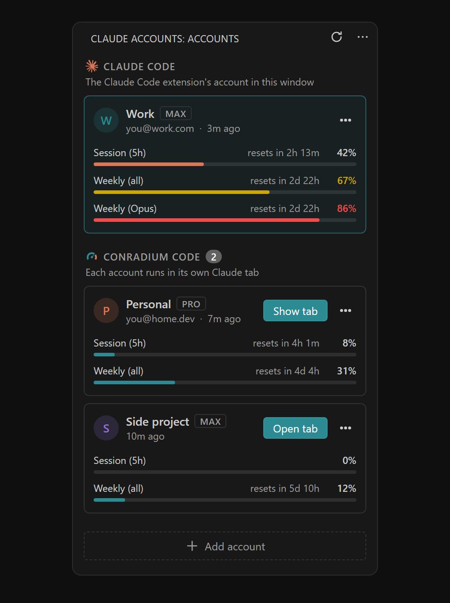
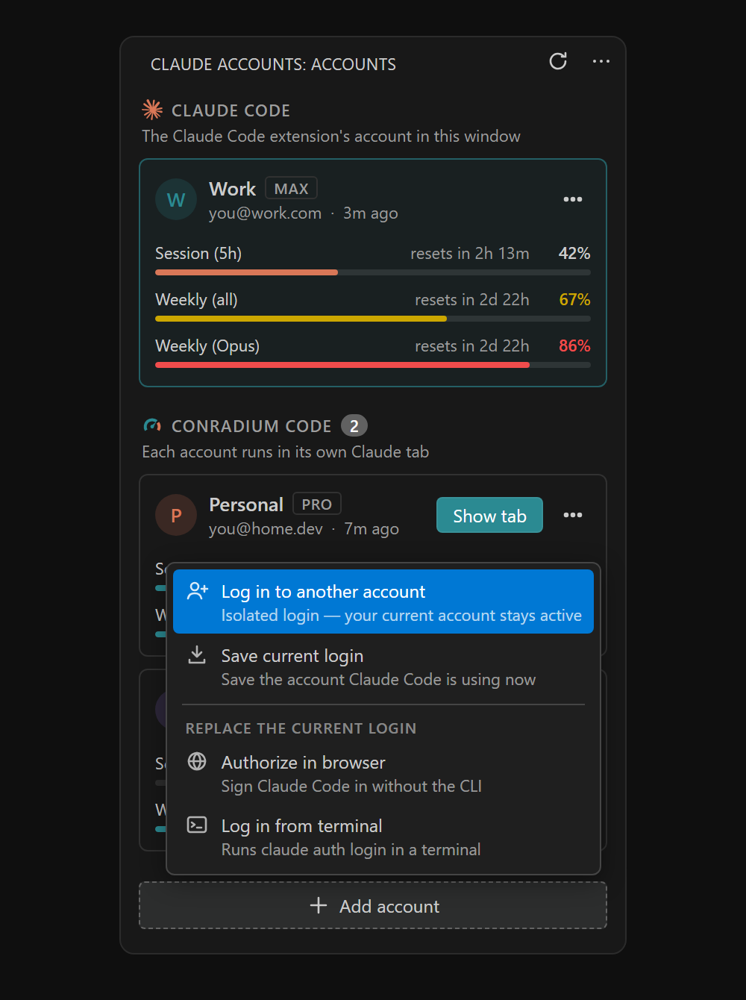
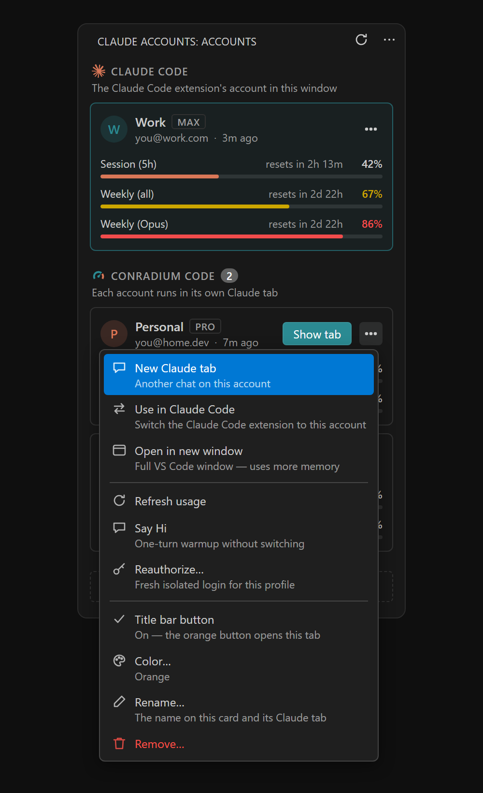

# Conradium Code: Claude Account Switcher

Use several Claude accounts in **Claude Code** for VS Code, and see how much usage each one has left.

When one account hits its 5-hour or weekly limit, switch to another in one click. No logging out and back in.



> This is an unofficial, community-made extension. It is not affiliated with, endorsed by or sponsored by Anthropic. Claude and Claude Code are trademarks of Anthropic, PBC.

## What you can do

- **Save up to five accounts** and see each one's 5-hour and weekly usage, with time until reset.
- **Chat with any account in its own tab.** Claude tabs run next to Claude Code in the same window, each on its own account.
- **Switch Claude Code to another account** from the panel, the status bar or the command palette.
- **Stay logged in.** Logins are refreshed safely in the background, so you don't have to reauthorize every day.
- **Say Hi** to accounts you're not using, to start their usage window early.

## Getting started

1. Sign in to Claude Code as usual.
2. Click the **Claude Accounts** icon in the activity bar.
3. Click **+ Add account** → **Save current login** to save that account.
4. Click **+ Add account** → **Log in to another account** to add more. Your current Claude Code login is not affected.

That's it. Your saved accounts now show up in the panel with their usage.



## Using your accounts

The panel has two sections:

- **Claude Code**: the account the Claude Code extension uses in this window.
- **Conradium Code**: your other accounts.

Each account card has an **Open tab** button. More options are in the card's `⋯` menu.



### Claude tabs

**Open tab** opens a chat with that account right in the editor. You can also use the account's colored button in the editor title bar.

A Claude tab works much like Claude Code: streamed replies, tool calls with diffs, permission prompts, plan mode, `/` commands, `@` file references, images, chat history and checkpoints you can restore. You can have several tabs per account.

### Switching Claude Code to another account

Choose **Use in Claude Code** in an account's `⋯` menu, or click the account name in the status bar. VS Code needs to reload the window afterwards so Claude Code picks up the new account. You'll be asked first, unless you turn on `claudeSwitcher.autoReloadAfterSwitch`.

Changed your mind? Run **Claude: Undo last switch**.

### Separate windows

**Open in new window** in the `⋯` menu opens your project in a new VS Code window that runs on that account.

## Important: don't use `/logout` to change accounts

`/logout` cancels that login on Anthropic's side, so any saved copy of it stops working. To change accounts, use the panel or `/login` instead.

If an account does get logged out, its card shows a **Reauthorize** button.

## Requirements

- VS Code 1.85 or newer, with the Claude Code extension.
- The Claude Code CLI (`claude`) for Claude tabs, Say Hi and terminal login. On Windows you can install it from PowerShell:

  ```powershell
  irm https://claude.ai/install.ps1 | iex
  ```

- Windows or Linux. macOS Keychain is not supported yet.

### "claude is not recognized"

1. Run `where claude` in a terminal.
2. If it's found, restart VS Code.
3. If it's still not found, set `claudeSwitcher.claudeCommand` to the full path that `where claude` prints.

## Settings

Open them from the panel's `⋯` menu → **Settings**. The most useful ones:

| Setting | Default | What it does |
| --- | --- | --- |
| `claudeSwitcher.pollIntervalSeconds` | `240` | How often usage refreshes (minimum 180 seconds) |
| `claudeSwitcher.warnThresholdPercent` | `80` | Usage % at which the bar turns red and a usage alert shows |
| `claudeSwitcher.usageAlerts` | `true` | Notify when an account in use nears or reaches a usage limit |
| `claudeSwitcher.autoReloadAfterSwitch` | `false` | Reload the window after a switch without asking |
| `claudeSwitcher.claudeCommand` | `claude` | Path to the Claude Code CLI |
| `claudeSwitcher.sayHiModel` | `haiku` | Model used by Say Hi |
| `claudeSwitcher.showEditorTitleButton` | `true` | Show account buttons in the editor title bar |

## Privacy

- No telemetry. Nothing is sent to the extension's author or any third party.
- Saved logins are kept in VS Code's encrypted secret storage, on this computer only. Add your accounts separately on each computer.
- The extension only talks to Anthropic, to refresh logins and read usage.
- Use it for **your own** accounts.
- Usage limits come from an unofficial Anthropic endpoint, which may change without notice.

## How it works

Switching swaps the login in `~/.claude/.credentials.json` (keeping a backup for Undo). Claude tabs and separate windows give each account its own Claude Code config folder.

Claude Code's refresh tokens can only be used once. To keep every copy working, the extension uses the same refresh lock as Claude Code and writes each new token back to every place that login is stored.

## Development

```bash
npm install
npm run watch       # build in watch mode, then press F5 in VS Code
npm run build:vsix  # build the .vsix package
```

## License

MIT
